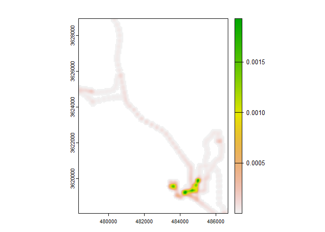
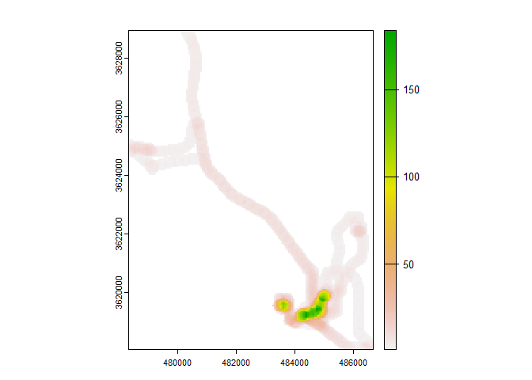
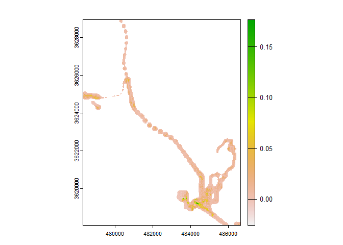

# twiGPS

## Time-Weighted spatial averaging (TWSA) methods Integrated with GPS measured environmental exposure

<!-- badges: start -->

[](https://app.codecov.io/gh/Graczykowski/twsagps?branch=master)
<!-- badges: end -->

`twiGPS` is a R package designed for calculating exposure and activity
space from GPS data. You can utilize Time-Weighted Spatial Averaging
(TWSA) methods to recognize distinct approaches to representing
spatially exposure and compare these methods.

## Installation

You can install the development version of twiGPS from
[GitHub](https://github.com/) with:

``` r
# install.packages("devtools")
devtools::install_github("Graczykowski/twiGPS")
```

## Usage

You are able to choose from 4 distinct TWSA methods by choosing those
package functions: `exposure_PO()` (Point Overlay), `exposure_KDE()`
(Kernel Density Estimation), `exposure_DR()` (Density Ranking) and
`exposure_LS()` (Line Segment).

You can start from data.frame with GPS coordinates:

``` r
library(twiGPS)
library(terra)

KDE = exposure_KDE(geolife_sandiego, coords = c("lon", "lat"), cellsize = 50,
                   bandwidth = 200, input_crs = "EPSG:4326", output_crs = "EPSG:32611")
plot(KDE)
```

 or you can
use sf and terra SpatVector objects:

``` r
geolife_v = vect(geolife_sandiego, geom = c("lon", "lat"), crs = "EPSG:4326")
geolife_v = project(geolife_v, "EPSG:32611")

LS = exposure_LS(geolife_v, cellsize = 50, bandwidth = 200)
plot(LS)
```

 When you
want to implement your environmental data to calculate environmental
exposure instead of activity space you should use `env_data` argument:

``` r
ndvi = rast(system.file("extdata/landsat_ndvi.tif", package = "twiGPS"))
DR_env = exposure_DR(geolife_v, bandwidth = 200, env_data = ndvi)
plot(DR_env)
```

 You can
compare statistics of all TWSA methods using `exposure_stats()`:

``` r
statistics = c("area", "min", "max", "mean", "std", 'sum')

exposure_stats(KDE, LS, DR_env, stats = statistics,
               row_names = c("KDE", "Line Segment",
                             "Density Ranking NDVI"))
#>                          area           min          max         mean
#> KDE                  12637505  5.211473e-12 1.929769e-03 8.419045e-05
#> Line Segment         13195447  1.000000e+00 1.840000e+02 1.321369e+01
#> Density Ranking NDVI  6095124 -2.563862e-02 1.768227e-01 1.102472e-02
#>                               std          sum
#> KDE                  2.215934e-04     0.425246
#> Line Segment         2.627930e+01 69689.000000
#> Density Ranking NDVI 1.529078e-02    74.604280
```
